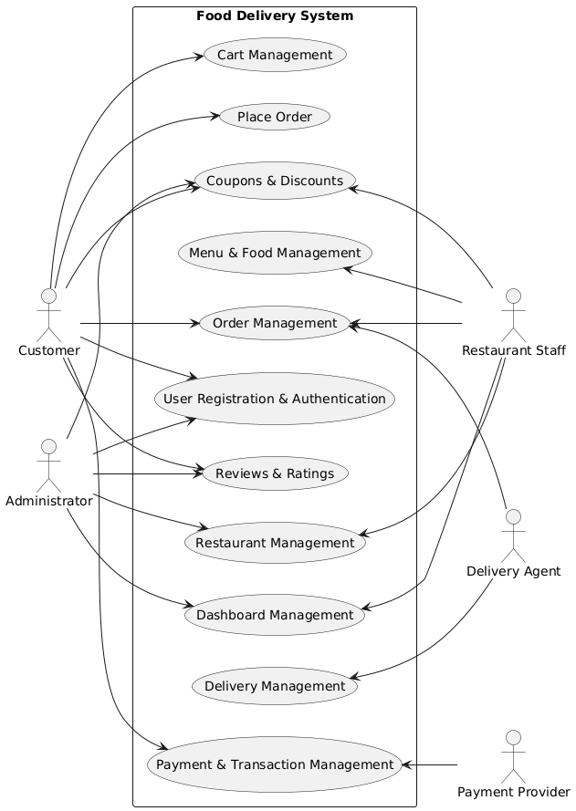
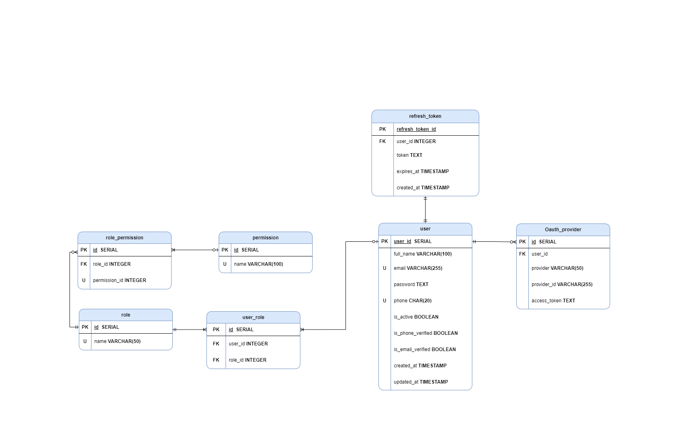

# Food Delivery System

## Table of Contents

- [Project Vision](#project-vision)
- [Domain Description](#domain-description)
- [Actors](#actors)
- [Requirements](#requirements)
- [Constraints](#constraints)
- [Assumptions](#assumptions)
- [Use Cases](#use-cases)
- [Data Model](#data-model)

## Project Vision

The Food Delivery System aims to create a seamless platform connecting customers, restaurants, and delivery agents. Our vision is to provide an efficient, user-friendly interface where customers can browse restaurants, place orders, track deliveries in real-time, and make secure payments, while restaurants can manage their menus and orders, and delivery agents can efficiently handle deliveries.

## Domain Description

The Food Delivery System operates within the food service industry, specifically targeting the online food ordering and delivery space. It serves as an intermediary platform that connects three primary stakeholders: customers seeking food delivery, restaurants offering their menu items, and delivery agents responsible for transporting orders from restaurants to customers. The system also interfaces with payment providers to facilitate transactions.

## Actors

| Actor            | Description                                                                              |
| ---------------- | ---------------------------------------------------------------------------------------- |
| Customer         | End-users who browse restaurants, place orders, make payments, and track deliveries      |
| Restaurant Staff | Representatives who manage restaurant profiles, menus, and process incoming orders       |
| Administrator    | System administrators who oversee the platform, manage users, and view analytics         |
| Delivery Agent   | Personnel responsible for picking up orders from restaurants and delivering to customers |
| Payment Provider | External service that processes payment transactions                                     |

## Requirements

### Functional Requirements

| ID  | Requirement                                                        |
| --- | ------------------------------------------------------------------ |
| F1  | Cart Management (add, modify, view, clear, checkout)               |
| F2  | User Registration & Authentication (signup, login, password reset) |
| F3  | Role-based Access Control                                          |
| F4  | Restaurant Browsing with Search & Filters                          |
| F5  | Menu Management & Browsing                                         |
| F6  | Order Placement & Tracking                                         |
| F7  | Order Cancellation                                                 |
| F8  | Order History & Notifications                                      |
| F9  | Multiple Payment Method Support                                    |
| F10 | Multiple Delivery Address Management                               |
| F11 | Customer Ratings & Reviews                                         |
| F12 | Customer Support Chat                                              |
| F13 | Offers & Discounts Management                                      |
| F14 | Analytics Dashboard for Administrators                             |
| F15 | Restaurant-specific Dashboard                                      |
| F16 | Reports Generation (Daily/Monthly)                                 |
| F17 | Email/SMS Notifications                                            |

### Non-Functional Requirements

| ID  | Requirement                       |
| --- | --------------------------------- |
| NF1 | high system availability          |
| NF2 | Secure password encryption        |
| NF3 | Intuitive user interface          |
| NF4 | Cross-browser compatibility       |
| NF5 | Mobile and desktop responsiveness |
| NF6 | Consistent coding standards       |
| NF7 | Data backup and recovery          |
| NF8 | API rate limiting                 |

## Constraints

| ID  | Constraint  | Description                                                                      |
| --- | ----------- | -------------------------------------------------------------------------------- |
| C1  | Integration | The system must integrate with specified third-party services                    |
| C2  | Regulations | The system must comply with relevant food safety and data protection regulations |
| C3  | Support     | The system must support specified browsers and devices                           |

## Assumptions

| ID  | Assumption               | Description                                                                       |
| --- | ------------------------ | --------------------------------------------------------------------------------- |
| A1  | Internet Connectivity    | Users have reliable internet access                                               |
| A2  | Device Compatibility     | Users have compatible devices to access the system                                |
| A3  | Restaurant Participation | Restaurants are willing to participate and maintain their information             |
| A4  | Delivery Services        | Delivery agents are available to fulfill orders                                   |
| A5  | Third-party Services     | Required third-party services (payment, maps, etc.) are available and functioning |
| A6  | User Adoption            | Target users will adopt the platform if it meets their needs                      |

## Use Cases

### Use Case Diagram

_Figure 1: Use Case Diagram for Food Delivery System_

### Key Use Cases

The system supports the following primary use cases, as illustrated in the diagram above:

1. **Cart Management**: Customers can manage their shopping cart
2. **Place Order**: Customers can place food orders
3. **Coupons & Discounts**: Customers can apply coupons and discounts
4. **Menu & Food Management**: Restaurant staff can manage food items and menus
5. **Order Management**: Both customers and restaurant staff interact with order processing
6. **User Registration & Authentication**: Users can register and authenticate. [Implementation](./Use%20Cases/user_management.md)
7. **Reviews & Ratings**: Customers can provide feedback
8. **Restaurant Management**: Administrators can manage restaurant information
9. **Dashboard Management**: Administrators can access system analytics
10. **Delivery Management**: Delivery agents can manage deliveries
11. **Payment & Transaction Management**: Payment providers process transactions

## Data Model

### Entity Relationship Diagram

_Figure 2: Entity Relationship Diagram for Food Delivery System_

### Key Entities

The system's data model consists of the following key entities and relationships, as shown in the ERD above:

- **User**: Stores user account information and authentication details
- **Role**: Defines user roles in the system
- **Role_Permission**: Maps roles to specific permissions
- **Permission**: Defines system permissions
- **User_Role**: Associates users with roles
- **Refresh_Token**: Manages authentication tokens
- **OAuth_Provider**: Handles third-party authentication

The data model supports the security requirements through role-based access control and maintains relationships between users, roles, and permissions.
