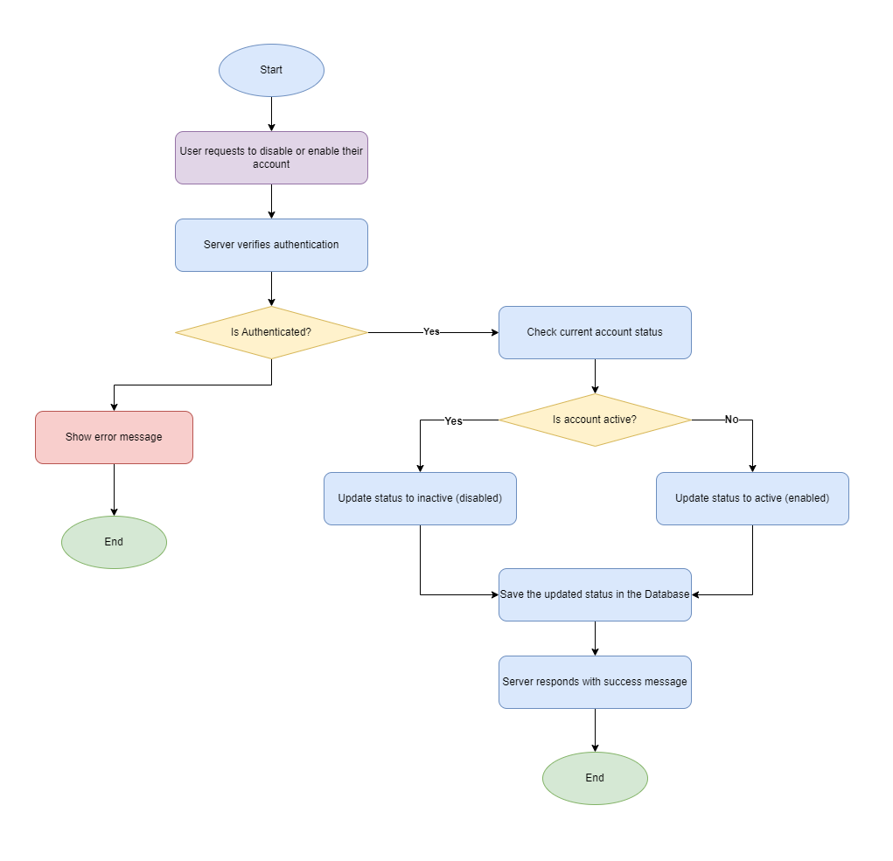

# User Registration & Authentication

## Table of Contents

- [1. Use Case Overview](#1-use-case-overview)
  - [1.1 Brief Description](#11-brief-description)
  - [1.2 Actors](#12-actors)
  - [1.3 Preconditions](#13-preconditions)
  - [1.4 Post-conditions](#14-post-conditions)
- [2. Use Case Specification](#2-use-case-specification)
  - [2.1 Sign Up](#21-sign-up)
    - [Flowchart](#211-sign-up-flowchart)
    - [Sequence Diagram](#212-sign-up-sequence-diagram)
    - [Pseudocode](#213-sign-up-pseudocode)
  - [2.2 Login](#22-login)
    - [Flowchart](#221-login-flowchart)
    - [Sequence Diagram](#222-login-sequence-diagram)
    - [Pseudocode](#223-login-pseudocode)
  - [2.3 Forgot Password](#23-forgot-password)
    - [Flowchart](#231-forgot-password-flow-diagram)
    - [Sequence Diagram](#232-forgot-password-sequence-diagram)
    - [Pseudocode](#233-forgot-password-pseudocode)
  - [2.4 Update Profile](#24-update-profile)
    - [Flowchart](#241-update-profile-flow-diagram)
    - [Sequence Diagram](#242-update-profile-sequence-diagram)
    - [Pseudocode](#243-update-profile-pseudocode)
  - [2.5 Enable/Disable Account](#25-enabledisable-account)
    - [Flowchart](#251-enabledisable-account-flow-diagram)
    - [Sequence Diagram](#252-enabledisable-account-sequence-diagram)
    - [Pseudocode](#253-enabledisable-account-pseudocode)
  - [2.6 Logout](#26-logout)
    - [Flowchart](#261-logout-flow-diagram)
    - [Sequence Diagram](#262-logout-sequence-diagram)
    - [Pseudocode](#263-logout-pseudocode)
  - [2.7 Social Media Authentication](#27-social-media-authentication)
    - [Flowchart](#271-social-media-authentication-flow-diagram)
    - [Sequence Diagram](#272-social-media-authentication-sequence-diagram)
    - [Pseudocode](#273-social-media-authentication-pseudocode)
  - [2.8 Email Verification](#28-email-verification)
    - [Flowchart](#281-email-verification-flow-diagram)
    - [Sequence Diagram](#282-email-verification-sequence-diagram)
    - [Pseudocode](#283-email-verification-pseudocode)
- [3. Business Rules](#3-business-rules)
  - [3.1 Password Policy](#31-password-policy)
  - [3.2 Account Security](#32-account-security)
  - [3.3 Session Management](#33-session-management)
  - [3.4 Social Authentication Policy](#34-social-authentication-policy)

## 1. Use Case Overview

### 1.1 Brief Description

This use case describes the processes by which users register for and authenticate to the food ordering application, including account management functionalities such as password recovery, profile management, and account status control.

### 1.2 Actors

- **Customer** - End user of the application who orders food
- **Administrator** - System administrator who manages user accounts
- **System** - The food ordering application system
- **Third-Party Auth Provider** - External identity provider (Google, Facebook, etc.)

### 1.3 Preconditions

- The application is installed and running on the user's device
- The user has internet connectivity

### 1.4 Post-conditions

#### Success End Condition

- User successfully creates an account and/or authenticates to the system
- User profile is created/updated in the system
- User can access appropriate system features

#### Failure End Condition

- User account is not created or authenticated
- Error message is displayed to the user

## 2. Use Case Specification

### 2.1 Sign Up

#### Main Flow

1. User selects "Sign Up" option from the application interface
2. System displays the registration form
3. User enters required information (email, password, name)
4. User submits the registration form
5. System validates the entered information
6. System checks if email already exists
7. System creates a new user account
8. System sends verification code to the user's email
9. User receives email with verification code
10. User enters verification code in the application
11. System validates the verification code
12. System activates the user account
13. System notifies user of successful registration

#### Alternative Flows

- **A1: Invalid Information**
  1. System identifies invalid information
  2. System displays error messages
  3. User corrects information and resubmits
- **A2: Email Already Exists**
  1. System identifies that the email is already registered
  2. System displays notification
  3. System suggests login or password recovery
- **A3: Invalid Verification Code**
  1. User enters incorrect verification code
  2. System displays error message
  3. User requests new code or checks email again

#### 2.1.1 Sign Up Flowchart


#### 2.1.2 Sign Up Sequence Diagram


#### 2.1.3 Sign Up Pseudocode

```js
function registerUser(userData) {
  const error = validateRegisterData(userData);
  if (error) return error.message;

  if (userExists(userData.email)) return "User already exist!";

  let hashedPassword = hashPassword(password);
  let verificationToken = generateToken();

  saveUserToDatabase(userData);

  sendVerificationEmail(userData.email, verificationToken);

  return "Registration successful, please verify your email";
}
```

---

### 2.2 Login

#### Main Flow

1. User navigates to login screen
2. User enters email and password
3. User submits login credentials
4. System validates credentials
5. System authenticates user
6. System redirects user to the application home page

#### Alternative Flows

- **A1: Invalid Credentials**
  1. System cannot authenticate user
  2. System displays error message
  3. User can retry or select "Forgot Password"
- **A2: Inactive Account**
  1. System identifies that the account is not activated
  2. System displays account activation required message
  3. System offers to resend verification code

#### 2.2.1 Login Flowchart


#### 2.2.2 Login Sequence Diagram


#### 2.2.3 Login Pseudocode

```js
function login(userData) {
  const error = validateLoginData(userData);
  if (error) return error.message;

  const user = getUserByEmail(userData.email);
  if (!user) return "User doesn't exist!";

  isPasswordCorrect = validateUserPassword(userData.password, user.password);
  if (!isPasswordCorrect) return "Invalid credentials";

  const jwtToken = generateJWT(user);

  return { message: "Login successful", token: jwtToken };
}
```

---

### 2.3 Forgot Password

#### Main Flow

1. User selects "Forgot Password" option
2. System displays password recovery form
3. User enters registered email
4. User submits the form
5. System verifies the email exists
6. System sends password reset link to user's email
7. User receives email with reset link
8. User clicks on reset link
9. System validates the reset link
10. System displays new password form
11. User enters and confirms new password
12. System updates the user's password
13. System displays success message
14. System redirects user to login page

#### Alternative Flows

- **A1: Email Not Found**
  1. System displays generic confirmation message (for security)
  2. No email is actually sent
- **A2: Invalid Reset Link**
  1. System displays error message
  2. System redirects to forgot password page

#### 2.3.1 Forgot Password Flowchart


#### 2.3.2 Forgot Password Sequence Diagram


#### 2.3.3 Forgot Password Pseudocode

```js
function requestPasswordReset(email) {
    const user = getUserByEmail(email);

    if (!user) {
        return "User not found";
    }

    const resetToken = generateSecureToken();
    savePasswordResetToken(user.email, resetToken, expiresIn=1_hour);

    sendResetEmail(user.email, resetToken);

    return "Password reset link has been sent to your email";
}

function resetPassword(token, newPassword) {
  const user = getUserByResetToken(token);

  if (!user || isTokenExpired(token)) {
    return "Invalid or expired token";
  }

  const hashedPassword = hashPassword(newPassword);
  updateUserPassword(user.email, hashedPassword);
  removePasswordResetToken(token);

  return "Password has been reset successfully";
}
```

---

### 2.4 Update Profile

#### Main Flow

1. Authenticated user navigates to profile settings
2. System displays current user profile information
3. User modifies desired information
4. User saves changes
5. System validates the updated information
6. System updates user profile
7. System displays confirmation message

#### Alternative Flows

- **A1: Invalid Information**
  1. System displays specific error messages
  2. User corrects information and resubmits
- **A2: Email Change**
  1. System sends verification to new email
  2. User must verify new email before change takes effect

#### 2.4.1 Update Profile Flowchart


#### 2.4.2 Update Profile Sequence Diagram


#### 2.4.3 Update Profile Pseudocode

```js
function updateProfile(userId, newProfileData) {
  let user = getUserById(userId);

  if (!user) {
    return "User not found";
  }

  let updatedUser = updateUserInDatabase(userId, newProfileData);

  return updatedUser ? "Profile updated successfully" : "Profile update failed";
}
```

---

### 2.5 Enable/Disable Account

#### Main Flow

1. User navigates to account settings
2. User selects "Disable Account" option
3. System displays confirmation prompt
4. User confirms account disabling
5. System updates account status
6. System logs out the user
7. System redirects to the application landing page

#### Alternative Flows

- **A1: Re-enable Account**
  1. User logs in with credentials for disabled account
  2. System offers re-activation option
  3. User confirms re-activation
  4. System updates account status to active

#### 2.5.1 Enable/Disable Account Flowchart



#### 2.5.2 Enable/Disable Account Sequence Diagram


#### 2.5.3 Enable/Disable Account Pseudocode

```js
function enableAccount(userId) {
  let user = getUserById(userId);

  if (!user) {
    return "User not found";
  }

  updateUserStatus(userId, "active");

  return "Account enabled successfully";
}

function disableAccount(userId) {
  let user = getUserById(userId);

  if (!user) {
    return "User not found";
  }

  updateUserStatus(userId, "inactive");

  return "Account disabled successfully";
}
```

---

### 2.6 Logout

#### Main Flow

1. Authenticated user selects "Logout" option
2. System ends user session
3. System redirects user to the login page

#### 2.6.1 Logout Flowchart


#### 2.6.2 Logout Sequence Diagram


#### 2.6.3 Logout Pseudocode

```js
function logout() {
  sessionToken = getCurrentSessionToken();

  invalidateUserSession(sessionToken);

  clearSessionCookie();

  redirectToLoginPage();
}
```

---

### 2.7 Social Media Authentication

#### Main Flow

1. User selects "Sign in with [Provider]" option (Google, Facebook, etc.)
2. System redirects to the authentication page of the selected provider
3. User authorizes the application on the provider's page
4. Provider redirects back to the application with authentication token
5. System validates the token with the provider
6. System checks if the user exists in the database
7. If user doesn't exist, system creates a new account with information from provider
8. If user exists, system links the social account to the existing user account
9. System generates application authentication token
10. System redirects user to the application home page

#### Alternative Flows

- **A1: Authorization Denied**
  1. User denies authorization on the provider's page
  2. Provider redirects back with error
  3. System displays error message
  4. User can try again or use another authentication method
- **A2: Account Linking**
  1. Email from social provider matches existing email in system
  2. System asks user to link accounts or login to existing account
  3. User chooses preferred action

#### 2.7.1 Social Media Authentication Flow Diagram


#### 2.7.2 Social Media Authentication Sequence Diagram


#### 2.7.3 Social Media Authentication Pseudocode

```js
function initiateOAuthFlow(provider) {
  const authUrl = getOAuthUrl(provider);
  redirectToUrl(authUrl);
}

function handleOAuthCallback(providerToken, provider) {
  // Validate token with provider
  const userData = verifyTokenWithProvider(providerToken, provider);

  if (!userData) {
    return "Authentication failed";
  }

  // Check if user exists with the provided email
  let user = getUserByEmail(userData.email);

  if (!user) {
    // Create new user
    user = createUserFromOAuth(userData, provider);
  } else {
    // Link social account to existing user
    linkSocialAccount(user.id, provider, userData.providerId);
  }

  // Generate JWT for our application
  const jwtToken = generateJWT(user);

  return { message: "Login successful", token: jwtToken, user };
}
```

---

### 2.8 Email Verification

#### Main Flow

1. User receives email with verification link/code
2. User clicks on verification link or enters code in the application
3. System validates the verification token
4. System updates user account status to verified
5. System displays confirmation message
6. System redirects user to appropriate page (login or home)

#### Alternative Flows

- **A1: Invalid or Expired Token**
  1. System identifies invalid or expired verification token
  2. System displays error message
  3. System offers option to resend verification email
- **A2: Resend Verification**
  1. User requests new verification email
  2. System generates new verification token
  3. System sends new verification email
  4. System displays confirmation message

#### 2.8.1 Email Verification Flow Diagram


#### 2.8.2 Email Verification Sequence Diagram


#### 2.8.3 Email Verification Pseudocode

```js
function verifyEmail(token) {
  const verificationRecord = getVerificationByToken(token);

  if (!verificationRecord || isTokenExpired(verificationRecord)) {
    return "Invalid or expired verification token";
  }

  const user = getUserById(verificationRecord.userId);

  if (!user) {
    return "User not found";
  }

  updateUserVerificationStatus(user.id, true);
  removeVerificationToken(token);

  return "Email verified successfully";
}

function resendVerificationEmail(userId) {
  const user = getUserById(userId);

  if (!user) {
    return "User not found";
  }

  if (user.isVerified) {
    return "Email already verified";
  }

  // Remove old verification tokens
  removeAllVerificationTokens(userId);

  // Generate new token
  const newToken = generateVerificationToken();
  saveVerificationToken(userId, newToken, expiresIn=24_hours);

  // Send new verification email
  sendVerificationEmail(user.email, newToken);

  return "Verification email sent successfully";
}
```

---

## 3. Business Rules

### 3.1 Password Policy

- Minimum 8 characters
- Must contain at least one uppercase letter
- Must contain at least one number
- Must contain at least one special character

### 3.2 Account Security

- Accounts will be temporarily locked after 5 consecutive failed login attempts
- Password reset links expire after 1 hour
- Users must re-authenticate when changing password or email
- Email verification required for new accounts and email changes

### 3.3 Session Management

- User sessions expire after 24 hours of inactivity
- Refresh tokens valid for 7 days
- Users can be logged in on multiple devices simultaneously

### 3.4 Social Authentication Policy

- Users can link multiple social accounts to one application account
- Email from social provider must match application email for automatic linking
- Users can unlink social accounts as long as they have password authentication or another social provider linked
